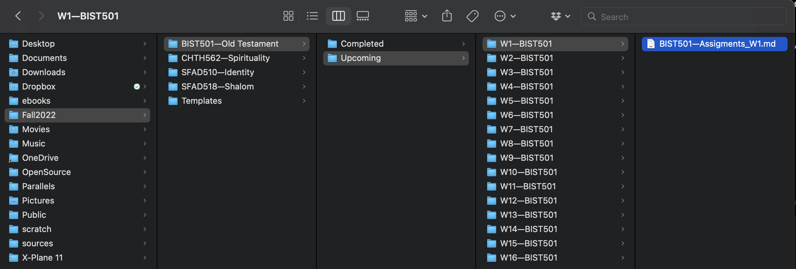

### Introduction
ObisidianHelper is script that will help create repetitive and useful hiearchies for you obisdian note taking tool. As of this release it is focused on making a hierarchy suitable for a typical college course. You specifiy some basic info, and the helper will create the course folders, put a bare-bones structure for each week, and also install some templates for obisidean for things like book reading notes and written assignment brainstorming and draft writing. 



You can modify the markdown of these files in the /templates folder to your liking before running the script.

### Installing 

1. From the Finder open the terminal app using Cmd-Space to open the Spotlight Window, or click the spotlight magnifying glass icon in the upper right corner of your menu bar. 
1. Type `terminal` to launch the terminal
1. At the prompt, change to the directory you installed the helper code. For example `cd ~/Downloads/Obsidian_Course_Helper`
1. Run the script with the command `python3 ./make_course.py`

The application will run and ask you a series of questions about your course. Below is a sample of what a typical run looks like.

### Example Creation of A Semester of Folders
```
What directory would you like to the course in? /tmp/GF
Avoiding the use of colons, slashes, and asterisks, what is the id of the course? CHTH562
how many weeks for the course?16
What is the full title of the course, e.g. History of the United States from 1600-1820? History of Cheese
What is a short name for the course, e.g. History, Biology, Bible, etc.? History
What is Professor's name (with Dr. if applicable)? Dr. Scott Evil
Tell us the days and times it meets (room is optional): Thursdays @ 10:30-11:30 CST                              
Enter the zoom link (return if none): https://georgefox.zoom.us/my/432sd15
```

The program will complete quickly after the last entry and on MacOS you can simple type:

`open /tmp/GF`

Or whatever directory you entered to open the folder in the Finder and transfer it to your Obsidian Vault.